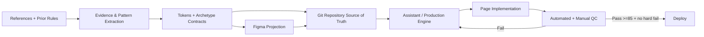

# سند جامع Visual Design & Experience Direction چتر قرمز

## وضعیت تحویل و فایل‌های آماده

نسخه‌ی **v1.0.0 — Production Direction Baseline** ساخته شد. بسته نهایی فقط یک گزارش متنی نیست؛ شامل Master Document، داده‌های ماشین‌خوان برای Engine، Design Tokens، Figma Starter، قرارداد تولید صفحه، Reference Matrix، نمونه‌های GSAP/Three.js، QC Rules، Accessibility Tests، Lighthouse CI، 3D Asset Contract و ساختار پیشنهادی Repository است.

| خروجی | فایل |
|---|---|
| بسته کامل قابل انتقال به Repository | **[دانلود Master Pack ZIP](sandbox:/mnt/data/Chatr-e-Ghermez-Visual-Master-v1.0.zip)** |
| سند اصلی PDF فارسی | **[دانلود Master PDF](sandbox:/mnt/data/chatreghermez-visual-master-v1.0/docs/MASTER_VISUAL_EXPERIENCE_DIRECTION_FA.pdf)** |
| Source اصلی Markdown | **[دانلود Master MD](sandbox:/mnt/data/chatreghermez-visual-master-v1.0/docs/MASTER_VISUAL_EXPERIENCE_DIRECTION_FA.md)** |
| Design Tokens ماشین‌خوان | **[دانلود design-tokens.json](sandbox:/mnt/data/chatreghermez-visual-master-v1.0/tokens/design-tokens.json)** |
| Tokens Studio / Figma bootstrap | **[دانلود tokens-studio.json](sandbox:/mnt/data/chatreghermez-visual-master-v1.0/tokens/tokens-studio.json)** |
| Figma Styles Starter قابل Import | **[دانلود Figma Starter SVG](sandbox:/mnt/data/chatreghermez-visual-master-v1.0/figma/figma-styles-starter.svg)** |
| قرارداد Page Archetypes برای Engine | **[دانلود page-archetypes.json](sandbox:/mnt/data/chatreghermez-visual-master-v1.0/engine/page-archetypes.json)** |
| قرارداد الزامی هر Assistant/Designer | **[دانلود implementation-contract.json](sandbox:/mnt/data/chatreghermez-visual-master-v1.0/engine/implementation-contract.json)** |
| Reference → Website Matrix | **[دانلود Matrix CSV](sandbox:/mnt/data/chatreghermez-visual-master-v1.0/engine/reference-to-website-matrix.csv)** |
| Numeric Quality Gates | **[دانلود qc-rules.json](sandbox:/mnt/data/chatreghermez-visual-master-v1.0/quality/qc-rules.json)** |
| دستور انتقال به Repo | **[دانلود Repo Upload Checklist](sandbox:/mnt/data/chatreghermez-visual-master-v1.0/repo/REPO_UPLOAD_CHECKLIST.md)** |

Repository مناسب پروژه از میان Repositoryهای متصل، `aesfandmand/red-umbrella-website` تشخیص داده شد. Root آن شامل `project_sources`، `site_assets`، `generated-assets` و نسخه‌های standalone صفحه Investment است؛ بنابراین پیشنهاد Next.js در Master Document به‌صراحت به‌عنوان **معماری پیشنهادی Production آینده** ثبت شده، نه اینکه به اشتباه ادعا شود Repository فعلی Next.js است. fileciteturn8file0L2-L6

**یک محدودیت واقعی باقی ماند:** GitHub Connector در این نشست عملیات read/search/fetch را در اختیار من قرار داد، اما هیچ action برای create/update/commit file ارائه نکرد. بنابراین نمی‌توانستم صادقانه ادعا کنم فایل‌ها را push کرده‌ام. بسته دقیقاً با ساختار مقصد Repository ساخته شده و `repo/upload-pack.sh` نیز داخل ZIP قرار گرفته است. همین محدودیت درباره Figma وجود داشت: Connector فعلی امکان خواندن Context/Variable/Screenshot را دارد، اما create/write یک فایل جدید `.fig` را نمی‌دهد؛ بنابراین به‌جای ساختن یک `.fig` جعلی، **Tokens Studio JSON + Figma-importable SVG + دستور ساخت Variables/Styles** تحویل داده شده است.

## نتیجه اصلی تحقیق و Visual North Star

تحقیق Referenceها یک نتیجه بسیار روشن دارد: **چتر قرمز نباید یک سایت “Agency Portfolio” معمولی شود.** معماری موجود خود پروژه نیز هویت مجموعه را «مجموعه یکپارچه عمودی» معرفی می‌کند و برای بازارها وزن B2B حدود ۶۰٪، خریدار سازه ۲۵٪، اکران ۵٪ و مشارکت/شهرداری ۱۰٪ در نظر گرفته است. همان سند، Palette فعلی شامل Ink `#17161B`، Red `#D21E2B`، Paper `#F6F4F0`، Gold `#C9A227` و Vazirmatn را نیز ثبت کرده است. fileciteturn5file0L2-L2

بنابراین North Star در Master Document به چهار عبارت تبدیل شده است:

**Spatial Precision + Editorial Confidence + Industrial Warmth + Evidence First**

یعنی صفحه باید هم «فضا» داشته باشد، هم «مهندسی» به نظر برسد، هم کاملاً انسانی و واقعی بماند، و مهم‌تر از همه، زیبایی را به **اثبات توان اجرا** متصل کند.

این نتیجه مستقیماً از Referenceهای معتبر هم پشتیبانی می‌شود. Fort Vega در Awwwards با Scroll، 3D، Interactive و Animation معرفی شده و بنابراین مرجع اصلی ما برای **Scroll Grammar** است، نه برای کپی ظاهر. citeturn0view4 Sky Clinics تجربه‌ای scroll-driven مبتنی بر Three.js و تغییر state محیطی را نشان می‌دهد؛ در سند آن را به Spatial Scrollytelling و chapter transitions تبدیل کرده‌ایم. citeturn0view5

Bucks Sauce برای چتر قرمز از نظر موضوعی مرجع نیست، اما استفاده آن از 3D product presentation، stop-motion و presentation فیزیکی محصول نشان می‌دهد چگونه می‌توان شیء را «قابل لمس» کرد؛ در ترجمه ما، این به فلز، پلکسی، نور، وینیل، چاپ، ضخامت و لایه‌های ساخت سازه تبدیل شده است. citeturn1search2turn10view2

**NRG مهم‌ترین Reference برای Structure Detail شد.** Awwwards در این پروژه عناصری مثل scroll-through، node interaction و virtual tour را ثبت کرده است؛ دقیقاً همان مدل ذهنی‌ای که برای تبدیل یک «سازه تبلیغاتی پیچیده» از عکس + جدول مشخصات به یک محصول قابل کاوش لازم داریم. citeturn1search0turn10view0

**Oryzo مهم‌ترین Reference برای Presentation Choreography شد.** Awwwards برای آن Reveal Transition، WebGL interaction، Intro/Gallery Transition و به‌طور مشخص 3D→2D→3D را ثبت کرده است؛ Master Document این الگو را برای Project/Portfolio به شکل «ورود سینمایی → flatten به اطلاعات قابل خواندن → بازگشت به Gallery/Outcome» تعریف می‌کند. citeturn1search1turn10view1

در Construction Insurtech، توضیح منتشرشده در Dribbble صراحتاً از exposed dashed grid، کنتراست construction/hazard، structural/brutalist typography، blueprint inspiration و modular blocks برای القای precision و reliability صحبت می‌کند. ما **منطق engineering grid و dimension language** را گرفته‌ایم ولی Yellow/Black و هویت بصری آن را رد کرده‌ایم. citeturn2search0turn10view4 Xurya نیز به‌عنوان مرجع tone صنعتی/B2B نگه داشته شده، اما چون evidence متنی موجود جزئیات pixel-level کافی در اختیار نمی‌داد، رنگ، grid یا typography خاصی از آن جعل و وارد سیستم نشده است. citeturn1search3turn10view3

هشت Pinterest Link نیز همگی در `reference-library.json` ثبت شده‌اند، اما short-linkهای Pinterest در محیط تحقیق resolve نشدند. بنابراین برخلاف کاری که می‌توانست خروجی را ظاهراً کامل ولی غیرقابل اعتماد کند، برای **PIN-01 تا PIN-08 هیچ Composition، Color، Grid یا Motion ساختگی ثبت نشده است.** آن‌ها فقط حامل قواعد انتزاعی قبلاً تأییدشده پروژه‌اند: 3D، Depth، Scene، Motion و پرهیز از Simple Card Rows.

سه Mockup شماتیک مستقل نیز از صفر برای خود چتر قرمز ساخته شده‌اند و داخل بسته قرار دارند:

[Home Hero Schematic](sandbox:/mnt/data/chatreghermez-visual-master-v1.0/mockups/home-hero-schematic.svg)  
[Structure Detail Schematic](sandbox:/mnt/data/chatreghermez-visual-master-v1.0/mockups/structure-detail-schematic.svg)  
[Project Case Schematic](sandbox:/mnt/data/chatreghermez-visual-master-v1.0/mockups/project-case-schematic.svg)

## معماری صفحات، Buying Situation و Conversion

سند معماری فعلی چتر قرمز قبلاً یک تصمیم بسیار مهم را ثبت کرده است: Landingها باید بر مبنای **Persona × Goal** ساخته شوند، نه صرفاً Product. همان معماری، مسیرهای Municipality، Gas Stations، Malls، Parking، Government، Shops و Exhibitions را از هم تفکیک کرده و Portfolio، Blog، Trust pages و Facilities را نیز در Information Architecture قرار داده است. fileciteturn7file0L2-L2 همچنین سند فعلی تصریح می‌کند کل سایت باید با تعداد محدودی Template/Archetype مدیریت شود، نه با ساخت صدها صفحه دستی مستقل. fileciteturn5file1

Master جدید این منطق را به هشت Archetype تولیدی تبدیل کرده است:

| Archetype | مأموریت اصلی Visual/Conversion |
|---|---|
| Home | اثبات توان یکپارچه و هدایت به مسئله/پروژه |
| Service Hub | کشف Capability بدون Card Grid |
| Service Landing | Scope + Evidence + Quote |
| Structure Detail | Product Stage + 3D + Specs + Datasheet |
| Investment | Risk Allocation + BOLT Story + Qualification |
| Project/Portfolio | Context → Constraint → Execution → Result |
| Solution | Problem/Industry → Solution Architecture |
| Knowledge | Answer-first + Evidence + Assisted Conversion |

برای هر هشت مورد، در `page-archetypes.json` و Master PDF این داده‌ها آمده است: Trigger/CEP، Primary و Secondary Persona/Buying Role، JTBD، ده Query اولویت‌دار، Required Evidence، Hero Composition، ترتیب Sectionها، Motion/Interaction، CTA، Conversion Metrics، Required Assets و Required Libraries. در مجموع **۸۰ Query Intent Hypothesis** ثبت شده است؛ عمداً آن‌ها را «volume-ranked keywords» ننامیده‌ایم، چون بدون Search Console/Keyword Planner واقعی چنین ادعایی قابل دفاع نیست.

برای نمونه، Structure Detail از «یک صفحه محصول با چند کارت» به این مسیر تبدیل شده است:

**3D Product Stage → Key Specs → Exploded/Material View → Use Environments → Real Installations → Variant Comparison → Manufacturing/Installation → Datasheet → FAQ → Quote**

Investment نیز از صفحه‌ای صرفاً پرزنتیشنی به:

**Site/Opportunity → مدل همکاری → ارزش ذی‌نفعان → Risk Allocation → توان فنی/تولیدی → Project Evidence → Lifecycle → Governance/Maintenance → Documents → Private Proposal**

تغییر می‌کند.

این تأکید روی Evidence فقط سلیقه UX نیست. قانون برگزاری مناقصات ایران «ارزیابی کیفی» را به سنجش توان انجام تعهدات پیوند می‌دهد و در مقررات مرتبط، توان فنی/مالی و صلاحیت طرف معامله می‌تواند وارد فرآیند ارزیابی شود. citeturn7search0turn7search3 از طرف دیگر، آگهی‌های واقعی مدیران بازاریابی B2B در بازار ایران مسئولیت‌هایی مانند KPI/ROI، بودجه، انتخاب و مذاکره با Agency، قرارداد، ROAS/CAC/ROMI و در محیط B2B صنعتی، Lead Scoring، CRM و چرخه فروش سازمانی طولانی را نشان می‌دهند. این‌ها شواهد خوبی برای این استنباط‌اند که سایت باید نه فقط «خریدار نهایی»، بلکه Researcher، Evaluator، Procurement و Economic Buyer را نیز مجهز به Evidence کند. citeturn7search2turn7search11turn7search20

به همین علت Neuromarketing در سند به «ترفندهای تحریک» تقلیل پیدا نکرده است. محور آن **Ambiguity Reduction، Processing Fluency، Authority با مدرک، Social Proof قابل تأیید، Risk Framing صادقانه و Salience کنترل‌شده** است. برای مثال، لوگوی مشتری بدون اجازه، عدد Performance بدون Source، Badge ساختگی، یا AI Render که وانمود کند پروژه واقعی است، همگی Hard Fail هستند.

## سیستم فنی، Figma و قرارداد Engine

پیشنهاد Production Stack به‌صورت **Recommendation، نه الزام غیرقابل تغییر** ثبت شده است:

**Next.js App Router + React + TypeScript + Headless CMS + GSAP + Three.js/R3F در نقاط انتخابی + Playwright/axe/Lighthouse در CI.**

Next.js در مستندات رسمی، App Router و image optimization را برای معماری و delivery مدرن ارائه می‌کند و مستندات self-hosting نیز وجود دارد؛ بنابراین انتخاب آن Deployment را به یک vendor خاص قفل نمی‌کند. citeturn4search0turn4search12turn4search16 Three.js ابزارهای رسمی برای glTF و loaderهایی مانند GLTFLoader دارد و pipeline آن با compressionهایی نظیر DRACO، Meshopt و KTX2 قابل ترکیب است؛ این دقیقاً برای Asset Pipeline سازه‌ها در Master Pack ثبت شده است. citeturn4search1turn4search13

برای React/3D نیز React Three Fiber به‌عنوان integration layer پیشنهاد شده، اما مستندات خود R3F درباره performance و پرهیز از update/mountهای نامناسب هشدار می‌دهند؛ به همین دلیل Master قرارداد سختی برای LOD، fallback، `frameloop="demand"` و محدودکردن 3D به archetypeهای ضروری دارد. citeturn4search3turn4search7

GSAP/ScrollTrigger برای pin/scrub/scroll-driven sequences مناسب است، اما در سند به‌عنوان ابزار choreography انتخابی تعریف شده نه یک smooth-scroll global اجباری. مستندات رسمی ScrollTrigger قابلیت‌های scrub، pin و snap را پوشش می‌دهند و GSAP نیز در سیاست فعلی خود دسترسی رایگان گسترده‌تری به ابزارها اعلام کرده است؛ با این حال Master صراحتاً می‌گوید License باید هنگام lockfile freeze دوباره بررسی شود. citeturn4search6turn6search0

Sanity در سند فقط Default پیشنهادی Headless CMS است. مستندات آن Structured Content، GROQ و Visual Editing/Next.js integrations را پوشش می‌دهند؛ در عین حال بعضی امکانات، مانند Media Library در برخی سطوح، وابسته به plan هستند. بنابراین Engine Contract به Sanity وابسته hard-code نشده و Strapi/Directus یا CMS مناسب دیگر قابل جایگزینی است. citeturn5search2turn5search8turn5search11

Design Token source نیز اکنون machine-readable است. Palette اولیه از Repository فعلی استخراج و با Typography، Spacing، Radius، Shadow، Motion، Layout و Performance Budget گسترش داده شده است. fileciteturn5file0L2-L2

نمونه‌ای از Token Contract:

```json
{
  "color": {
    "ink": "#17161B",
    "red": "#D21E2B",
    "redDeep": "#A21420",
    "paper": "#F6F4F0",
    "muted": "#74727A",
    "line": "#E7E3DC",
    "gold": "#C9A227"
  },
  "layout": {
    "maxWidth": 1240,
    "columns": {
      "desktop": 12,
      "tablet": 8,
      "mobile": 4
    }
  },
  "motion": {
    "duration": {
      "instant": 120,
      "fast": 220,
      "base": 420,
      "slow": 700,
      "scene": 1200
    }
  }
}
```

مهم‌تر از Tokenها، فایل `implementation-contract.json` است. هر Engine/Assistant قبل از طراحی باید این ترتیب را طی کند:

**Archetype → Buying Situation → Trigger/CEP → JTBD → Evidence Inventory → Conversion Goal → Spatial Level → Tokens → Layout → Motion → Mobile → QC**

یعنی Assistant حق ندارد کار را با «یک Hero خیلی شیک طراحی کن» شروع کند.

در قرارداد نیز صریحاً آمده است:

> 3D/Motion فقط وقتی مجاز است که Space، Material، Process، State یا Hierarchy را توضیح دهد.

> Repeated Equal Card Rows نمی‌توانند Grammar غالب صفحه باشند.

> هیچ Metric، Client، Testimonial، Certification، Dimension یا Proof بدون Provenance ساخته نمی‌شود.

> Mobile باید Recompose شود، نه اینکه Desktop کوچک شود.

> Reference حل‌نشده نمی‌تواند منبع جزئیات بصری باشد.

## Quality Gates و معیار جلوگیری از صفحه ضعیف

Quality Gate به‌جای «نظر شخصی طراح» به دو لایه Hard Fail و Weighted Score تبدیل شده است.

Core Web Vitals فعلی تجربه خوب را تقریباً با LCP حداکثر ۲.۵ ثانیه، INP حداکثر ۲۰۰ میلی‌ثانیه و CLS حداکثر ۰.۱ در صدک ۷۵ تعریف می‌کنند؛ این حدود در `qc-rules.json` به‌عنوان Production Targets وارد شده‌اند. citeturn9search0turn9search3 Lighthouse نیز امکان Audit خودکار Performance، Accessibility، Best Practices و SEO و اجرای CI را می‌دهد؛ با این حال Master تأکید می‌کند Lab Score جای Field Data را نمی‌گیرد. citeturn5search3turn5search6

| Quality Gate | Target |
|---|---:|
| LCP field p75 | ≤ 2.5s |
| INP field p75 | ≤ 200ms |
| CLS field p75 | ≤ 0.10 |
| Lighthouse Performance | ≥ 90 |
| Lighthouse Accessibility | ≥ 95 |
| Lighthouse Best Practices | ≥ 95 |
| Lighthouse SEO | ≥ 95 |
| Primary target | ترجیحاً ≥ 44×44px |
| Minimum interactive target | ≥ 24×24px |
| 3D FPS target Desktop | ≥ 55 |
| 3D FPS target Mobile | ≥ 45 |
| Initial 3D Hero Transfer | target ≤ 450KB |
| Single optimized GLB | target ≤ 4MB |
| Identical card sequence | حداکثر 3 |
| Hero headline desktop | target ≤ 2 lines |
| Evidence provenance | 100% برای Metric/Logo/Testimonial |

WCAG 2.2 برای Target Size در سطح AA حداقل 24×24 CSS px را در شرایط مربوط تعریف می‌کند و معیار Enhanced به 44×44 می‌رسد؛ Master برای CTAهای اصلی 44×44 را ترجیح می‌دهد. citeturn8search0 همچنین `prefers-reduced-motion` باید برای کاهش motionهای غیرضروری استفاده شود و این موضوع در CSS/GSAP/WebGL Contract به Hard Gate تبدیل شده است. citeturn8search8 Playwright و axe نیز برای Audit خودکار در CI استفاده شده‌اند، هرچند مستندات تست دسترس‌پذیری تأکید می‌کنند automated testing جای تست دستی کامل را نمی‌گیرد. citeturn8search1turn8search7

Weighted QC نیز از ۱۰۰ محاسبه می‌شود:

**Visual Hierarchy 15 + Evidence/Risk Reduction 15 + Archetype/JTBD Fit 15 + Originality 10 + Motion Purpose 10 + Responsive Recomposition 10 + Performance 10 + Accessibility 10 + Token Compliance 5.**

حداقل قبولی **85/100 با صفر Hard Fail** است. بنابراین یک صفحه با Score 93 که Fake Testimonial داشته باشد، یا Reduced Motion را رعایت نکند، **مردود** است.

از مهم‌ترین Hard Failهای ثبت‌شده:

**Card Soup، Proof جعلی، 3D بدون Fallback، Motion بدون Reduced Mode، Pinterest unresolved به‌عنوان منبع جزئیات بصری، Primary CTA غیرقابل دسترس، و استفاده از AI/Stock به‌جای Evidence واقعی.**

برای این کنترل‌ها فایل‌های اجرایی هم در Pack وجود دارند:

[Playwright + axe Test](sandbox:/mnt/data/chatreghermez-visual-master-v1.0/quality/playwright-a11y.spec.ts)  
[Lighthouse CI Config](sandbox:/mnt/data/chatreghermez-visual-master-v1.0/quality/lighthouserc.cjs)  
[Accessibility Checklist](sandbox:/mnt/data/chatreghermez-visual-master-v1.0/quality/accessibility-checklist.md)  
[GSAP ScrollTrigger Sample](sandbox:/mnt/data/chatreghermez-visual-master-v1.0/motion/gsap-scrolltrigger-sample.tsx)  
[R3F Structure Viewer Sample](sandbox:/mnt/data/chatreghermez-visual-master-v1.0/motion/r3f-structure-viewer-sample.tsx)

## مسیر Production، Repo و برآورد اجرا

Master Document این جریان را به‌صورت Mermaid نیز در Source دارد:



برآورد effort برای تیم فرضی شما—یک UI Designer، یک Motion/3D Artist، یک Front-end و یک PM—در سند بین **۱۷۰ تا ۲۵۰ person-hour** است. این یک برآورد پروژه است، نه مدت تقویمی قطعی؛ بخشی از فعالیت‌ها قابل موازی‌سازی‌اند.

| Milestone | Effort |
|---|---:|
| Reference analysis & evidence catalog | 18–24h |
| Asset collection/licensing audit | 14–22h |
| Tokenization + Engine Contracts | 12–16h |
| Figma Foundation + Archetype Frames | 28–40h |
| 3D Language + Hero Prototypes | 28–44h |
| Dev Handoff + Component Primitives | 24–36h |
| Sample Production Structure Detail | 30–44h |
| QC + Accessibility + Repo Packaging | 16–24h |
| **مجموع** | **170–250h** |

مهم‌ترین پیشنهاد اجرایی Master این است که اولین صفحه‌ای که با این سیستم واقعاً Production شود **Structure Detail** باشد، نه Home. دلیل معماری آن است که Structure Detail تقریباً همه اجزای مهم سیستم را آزمایش می‌کند: 3D، Material، Specs، Evidence، Procurement logic، Downloadable Datasheet، Mobile degradation، Performance Budget و CTA. این یک استنباط طراحی از Referenceهای NRG/Bucks، معماری Product/Structure موجود در Repository و الزامات Procurement است. citeturn1search0turn10view0turn1search2turn7search0

از آنجا که Architecture Map فعلی خود پروژه نیز «صفحه محصول/سازه» را به‌عنوان Template مستقل ثبت کرده است، این انتخاب با IA موجود تضاد ندارد. fileciteturn5file1

**بسته نهایی آماده انتقال به `design-system/visual-master/` در Repository است؛ تنها بخش انجام‌نشده، خودِ Push به GitHub و ساخت Native `.fig` است که به‌دلیل نبود write action در Connectorهای این نشست از نظر فنی قابل انجام نبود.** هیچ‌یک از این دو مورد در خروجی به‌صورت انجام‌شده وانمود نشده‌اند؛ sourceهای قابل version-control و دستور دقیق انتقال داخل Master Pack قرار دارند.